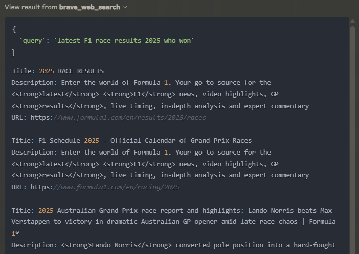

Until [yesterday](https://www.anthropic.com/news/web-search), Claude was one of the few LLMs which didn't natively have a search capability. With LLMs having a knowledge cut off date based on their training data this is a massive limitation. Having search is key to ask questions on any current topic or recent development. I found myself going back to ChatGPT despite having a Claude Pro subscription for this reason. This gave me a perfect opportunity to try implementing a MCP server to add search as a tool which Claude could then use when I asked a query.

# What is MCP?

MCP stands for Model Context Protocol and was [launched by Anthropic in November of last year](https://www.anthropic.com/news/model-context-protocol). It's a standardized way for an LLM to interact with external tools. I'm sure you've thought while using an LLM, wouldn't it be great if I could use an LLM interact with some external website, e.g. Add an event to you google calendar. As with any protocol you have a client and a server, the client is attached to a chat application and the server is the component which interfaces with the external resource. It is possible to achieve this by coding your own software using an agentic framework like [Langgraph](https://www.langchain.com/langgraph) or [Pydantic AI](https://ai.pydantic.dev/) but these mean starting from scratch and implementing a feature from the ground up. The beauty of MCP, because it is standardized, you can connect it to a number of already existing clients, e.g. [Claude](https://modelcontextprotocol.io/quickstart/user), [Co-pilot](https://www.microsoft.com/en-us/microsoft-copilot/blog/copilot-studio/introducing-model-context-protocol-mcp-in-copilot-studio-simplified-integration-with-ai-apps-and-agents) or any other client which can act as a MCP client. The same is true with servers, you can add as many as you like and easily open source and share them. Its modular by design, with a clearly define interface between tool and chat interface.

# Using MCP to enable Claude search

To configure Claude to use a MCP server you'll need to follow these steps:

## 1. Build or reuse a Server

[Anthropic in their initial announcement](https://www.anthropic.com/news/model-context-protocol) open-sourced a number of already built servers which you can find in [their GitHub repository](https://github.com/modelcontextprotocol/servers).

Today we are going to implement one of these, the Brave-search MCP server. Brave Search is an independent search engine with its own index rather than relying on results from Google or Bing.

To begin with we'll need to clone the repo to get the code base.

``` bash
git clone https://github.com/modelcontextprotocol/servers.git
```

From here you can see there are a number of implementations of various tools, showing the versatility of MCP. We'll be using `/src/brave-search` so we can build the image with:

``` bash
docker build -t mcp/brave-search:latest -f src/brave-search/Dockerfile .
```

With that we are done getting the MCP server ready, so next we can look at setting up brave search.

## 2. Getting the keys to Brave Search

As our MCP server will be linking us to an external resource, Brave Search, we'll need to sign up to [Brave Search](https://brave.com/search/api/). In doing this you'll need to choose a plan and add your credit card details. Note you can use the free plan for this demo as it allows 2,000 queries for free. Once you are signed up you'll then be able to create an API key you'll want to copy and keep handy for the next step.

## 2. Configure Claude to use the server

To use MCP with Claude you need to [download claude desktop](https://claude.ai/download?ref=maginative.com) so that it can access the local MCP server on your machine. Once you have downloaded and logged in we'll next need to configure claude to use the server we created in step 1.

Its worth noting, I'm on a Windows machine but use WSL for my development and this is where docker is installed. We'll need to take this into account when we are configuring claude, as the claude app is on the windows side. To configure the tool you'll need to create a in the following location `%APPDATA%\Claude\claude_desktop_config` and add he following:

{ "mcpServers": { "brave-search": { "command": "wsl.exe", "args": \[ "bash", "-c", "docker run -i --rm -e BRAVE_API_KEY=<BRAVE_API_KEY> mcp/brave-search" \] } } }

Where we have replaced `<BRAVE_API_KEY>` with the API key created in step 2. Noitce are target of the command is WSL and not docker, as we are calling docker via WSL. With this the configuration is done.

If the claude app was open while you were doing this you'll need to reboot it. Note it minimises to the task bar, so be sure to right click and quit to force it to restart.

When you reopen the app you should see the following tool icon appear:


This indicates Claude has been able to start and connect to our MCP Server. On the occasions where you get the configuration wrong cluade will start but give you an error banner allowing you to click through and see the logs, so you can try and rectify the error.

You might be wondering why, adding one MCP server has added two tools. By clicking on the tool icon you get a description of the tools the MCP server(s) expose:


## 3. Make use of your new tool

With the tool now integrated we can now make use of it. If you are an F1 fan and missed last weekends race there are spoils below and given it was such a good race you should really watch it first.

Below we are asking Claude about some current F1 news:


We can see here claude is able to determine that I am asking a question it can't answer based on its knowledge cutoff and therefore makes a call of the tool.

At this point it asks for permission to use the tool, ensuring you the human are always in control.


Once you give the permission we get the following response.


You can see it uses the `brave_web_search` tool as expected and gives us a correct summary of the race and would 100% agree with the comment about chaos!

The Claude app allows us to see the inner workings of the tool call. We can see the query that was sent off to Brave and the results that came back.



# What's going on under the hood?

Looking more closely at the source code we can see the following in the [index.ts](https://github.com/modelcontextprotocol/servers/blob/main/src/brave-search/index.ts), which is the `WEB_SEARCH_TOOL` object is defined with descriptions of both the tool and the inputs which will get passed to Claude so it knows what the tool can be used for and how to use it.

``` js
const WEB_SEARCH_TOOL: Tool = {
  name: "brave_web_search",
  description:
    "Performs a web search using the Brave Search API, ideal for general queries, news, articles, and online content. " +
    "Use this for broad information gathering, recent events, or when you need diverse web sources. " +
    "Supports pagination, content filtering, and freshness controls. " +
    "Maximum 20 results per request, with offset for pagination. ",
  inputSchema: {
    type: "object",
    properties: {
      query: {
        type: "string",
        description: "Search query (max 400 chars, 50 words)"
      },
      count: {
        type: "number",
        description: "Number of results (1-20, default 10)",
        default: 10
      },
      offset: {
        type: "number",
        description: "Pagination offset (max 9, default 0)",
        default: 0
      },
    },
    required: ["query"],
  },
};
```

This MCP server is just a couple hundred lines of code in a single file, with most of the logic written to interface with the Brave API. The simplicity is made possible by the Anthropic team creating MCP SDKs for many languages: [typescript](https://github.com/modelcontextprotocol/typescript-sdk), [python](https://github.com/modelcontextprotocol/python-sdk), [java](https://github.com/modelcontextprotocol/java-sdk), [rust](https://github.com/modelcontextprotocol/rust-sdk) etc.

What integration could you build?

# What's possible?

MCP servers give LLMs the ability to interact with a whole raft of external resources for example:

-   **Database MCP server:** could allow users with no understanding of SQL the ability to search a database and create insights.

<!-- -->

-   **File System MCP Server:** allowing the to access files on your local machine. No more copy and pasting when getting an LLM to review you docs. You could allow the server to edit files to allow you to collaboratively work on documents or software with an LLM

-   **Code Repository MCP Server**: you can integrate with code repositories like github to enable an LLM to review your code, or with some other tools to, take an issue, write some code and submit a PR!

-   **Calendar/Task Management MCP Server:** Allow the LLM to be a true assistant by giving it access to your calendar or to-do list app.

The possibilities are only limited by your imagination.

# Whats the catch?

You'll notice everything in this blog is local and that's for a good reason, MCP currently has no way to authenticate. This is one of the key items on the [roadmap](https://modelcontextprotocol.io/development/roadmap) and topic of discussion. You'll notice authentication is under **remote MCP support**. Its possible to see an agentic future where its standard practice for applications to expose a MCP server alongside their main UI. It will just be like writing some custom application using a sites API but rather your LLM will be able to do this for you.