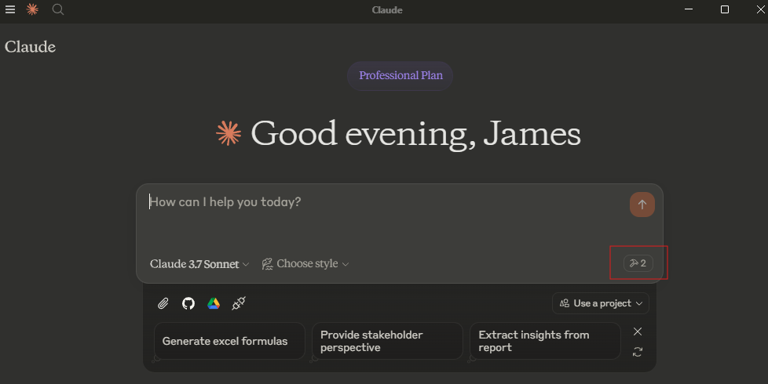
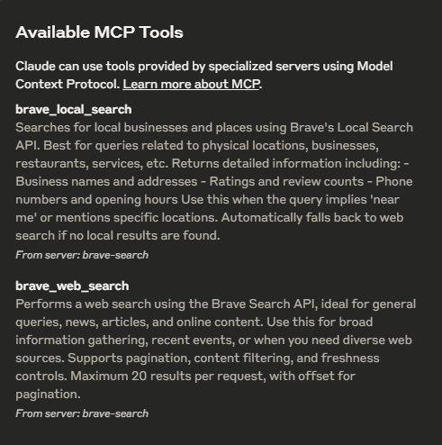
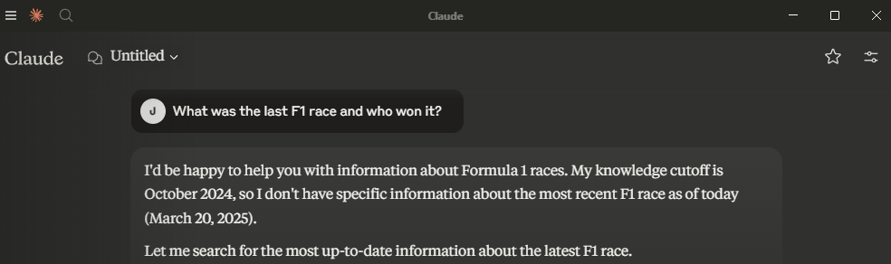
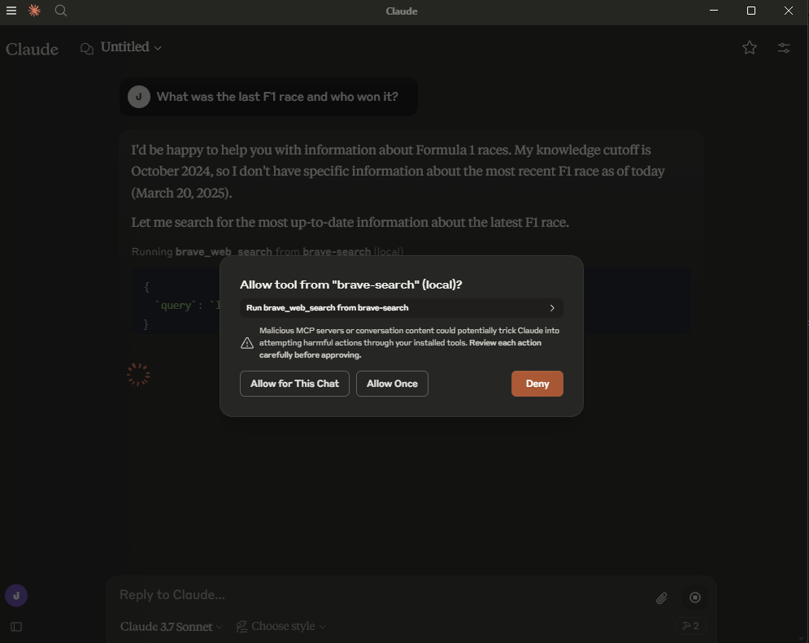
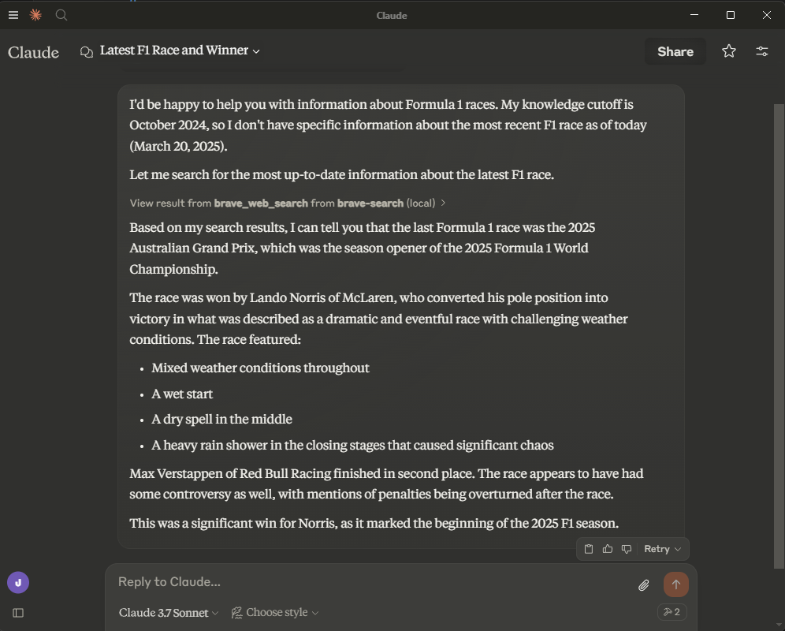

# Why is everyone talking about MCP Servers

Until [yesterday](https://www.anthropic.com/news/web-search), Claude was one of the few online LLMs which didn't natively have a search capability. With LLMs having a knowledge cut off date based on their training data, having search is key to ask questions on any current topic or recent development. I found myself going back to ChatGPT despite having a Claude Pro subscription for this reason. This gave me a perfect opportunity to try implementing a MCP to add search as a tool which Claude could then use when I asked a query.

## What is MCP?

MCP stands for Model Context Protocol and was [launched by Anthropic in November of last year](https://www.anthropic.com/news/model-context-protocol). It's a standardized way for an LLM to interact with external tools. I'm sure you've thought while using an LLM, wouldn't it be great if I could use an LLM to automate X or Y, but don't know where to start. It is possible to go down the route of coding your own agentic software using an agentic framework like [langgraph](add link) or [Pydantic AI](add link) but these mean starting from scratch and implementing a feature from the ground up. The beauty of MCP, because it is standardized, is that you can connect it to a number of already existing tools, e.g. [Claude](https://modelcontextprotocol.io/quickstart/user), [Co-pilot](https://www.microsoft.com/en-us/microsoft-copilot/blog/copilot-studio/introducing-model-context-protocol-mcp-in-copilot-studio-simplified-integration-with-ai-apps-and-agents) or any other tool which can act as a MCP client.

## Using MCP to enable Claude search

To configure Claude to use a MCP server you'll need to follow these steps:

### 1. Build or reuse a Server
[Anthropic in their initial announcement](https://www.anthropic.com/news/model-context-protocol) open-sourced a number of already built servers which you can find in [their GitHub repository](https://github.com/modelcontextprotocol/servers). Today we are going to implement the Brave-search MCP server. Brave Search is an independent search engine with its own index rather than relying on results from Google or Bing. What makes it particularly suitable for MCP integration is how straightforward its API is to implement. With just a few lines of code, you can connect Claude to Brave's search capabilities, enabling it to retrieve current information from across the web. The simple JSON response format makes it easy to parse results and incorporate them seamlessly into Claude's responses. 

This example is also a good one as it one of the open sourced tool within their repository making it easy to get started and exploring how MCP works.

To begin with we'll need to clone the repo to get the code base.

```bash
git clone https://github.com/modelcontextprotocol/servers.git
```

From here you can see there are a number of implementations of various tools, showing the versatility of MCP. Today we'll be using `/src/brave-search` so  we can build the image with:

```bash
docker build -t mcp/brave-search:latest -f src/brave-search/Dockerfile .
```
With that we are done on getting the MCP server ready, so next we can look at configuring claude to use this tool.

### 2. Getting the keys to Brave Search

As our MCP server will be linking us to an external resource, Brave Search, we'll need to sign up to [Brave Search](https://brave.com/search/api/). In doing this you'll need to choose a plan and add your credit card details. Note you can use the free plan for this demo as it allows 2,000 queries for free. Once you are signed up you'll then be able to create an API key you'll want to copy and keep handy for the next step.

### 2. Configure Claude to use the server

To use MCP with Claude you need to (download claude desktop)[https://claude.ai/download?ref=maginative.com] so that it can access local resources on your machine. Once you have downloaded and logged in we'll next need to configure claude to use the server we created in step 1.

One note to add here, I'm on a Windows machine but use WSL for my development and this is where docker is installed. We'll need to take this into account when we are configuring claude as the claude app is on the windows side. To configure the tool you'll need to create a in the following location `%APPDATA%\Claude\claude_desktop_config` and add he following:

{
  "mcpServers": {
    "brave-search": {
      "command": "wsl.exe",
      "args": [
	  "bash",
	  "-c",
	  "docker run -i --rm -e BRAVE_API_KEY=<BRAVE_API_KEY> mcp/brave-search"
      ]
    }
  }
}

Where we have replaced `<BRAVE_API_KEY>` with the API key created in step 2.

With this the configuration is done. If the claude app was open while you were doing this you'll need to reboot it. Note it minimises to the task bar, so be sure to right click and quit to force it to restart. When you reopen the app you should see the following tool icon appear.



### 3. Make use of your new tool

With the tool now integrated we can now make use of it. Adding the Brave MCP server gives us the following two tools for search:



And with that we can ask claude to make use of its tool. If you are an F1 fan and missed last weekends race there are spoils below and given it was such a good race you should watch it first.



We can see here claude is able to determine that I am asking a question is does not natively know so is going to call upon one of its tools to answer the queston.

At this point it asks for permission to use the tool, ensuring you the human are always in control.



Giving us the following response



You can see it uses the `brave_web_search` tool as expected and gives us a correct summary of the race.


## What's going on under the hood?

## What does this mean going forward


```
{
  `query`: `latest F1 race results 2025 who won`
}
Title: 2025 RACE RESULTS
Description: Enter the world of Formula 1. Your go-to source for the <strong>latest</strong> <strong>F1</strong> news, video highlights, GP <strong>results</strong>, live timing, in-depth analysis and expert commentary
URL: https://www.formula1.com/en/results/2025/races

Title: F1 Schedule 2025 - Official Calendar of Grand Prix Races
Description: Enter the world of Formula 1. Your go-to source for the <strong>latest</strong> <strong>F1</strong> news, video highlights, GP <strong>results</strong>, live timing, in-depth analysis and expert commentary
URL: https://www.formula1.com/en/racing/2025

Title: 2025 Australian Grand Prix race report and highlights: Lando Norris beats Max Verstappen to victory in dramatic Australian GP opener amid late-race chaos | Formula 1®
Description: <strong>Lando Norris</strong> converted pole position into a hard-fought race win during the season-opening Australian Grand Prix, which featured mixed weather conditions, multiple crashes, Safety Cars and a late-race downpour that caused huge drama.
URL: https://www.formula1.com/en/latest/article/norris-beats-verstappen-to-victory-in-dramatic-australian-gp-opener-amid.5rKGxQHJoDl1P8stMSHlIN

Title: Australian Grand Prix F1 race result 2025 after penalty overturned - The Race
Description: <strong>Lando Norris</strong> clung on through a race of wild mixed weather to win the 2025 Formula 1 season-opening Australian Grand Prix
URL: https://www.the-race.com/formula-1/australian-grand-prix-f1-race-result-2025/

Title: Adjusted 2025 F1 Australian Grand Prix results after Mercedes protest | RacingNews365
Description: ... <strong>Lando Norris</strong> converted pole position into victory at the season-opening Australian Grand Prix, in what were mixed conditions. The race started in wet conditions before a dry-line later appeared, before a sudden heavy rain shower in the closing stages caused chaos.
URL: https://racingnews365.com/2025-f1-australian-grand-prix-results

Title: 2025 Formula One World Championship - Wikipedia
Description: <strong>Jack Doohan</strong>, who replaced Ocon for the 2024 Abu Dhabi Grand Prix, obtained the seat at Alpine for 2025. Valtteri Bottas and Zhou Guanyu both left Sauber after three years, the former rejoining Mercedes as a reserve driver after having previously raced for the team from 2017 to 2021, and the ...
URL: https://en.wikipedia.org/wiki/2025_Formula_One_World_Championship

Title: 2025 F1 Australian Grand Prix - Race Results after penalty reversed
Description: Full results from the Australian Grand Prix, Round 1 of the 2025 F1 world championship. ... <strong>Lando Norris</strong> claimed victory in an eventful F1 season-opening Australian Grand Prix.  · Norris held his nerve in treacherous conditions to beat Red Bull&#x27;s Max Verstappen to win a chaotic and dramatic ...
URL: https://www.crash.net/f1/results/1065305/1/2025-f1-australian-grand-prix-race-results

Title: Winners and losers from F1's 2025 Australian Grand Prix - The Race
Description: With a crash before the <strong>race</strong> had even begun, rain on and off all day and a lot of late twists, there&#x27;s an ample list of Melbourne winners and losers for us to assess
URL: https://www.the-race.com/formula-1/winners-losers-f1-2025-australian-grand-prix/

Title: 2025 Australian Grand Prix - Official F1 results (Albert Park)
Description: Here are the complete F1 results from the 2025 Australian Grand Prix at Albert Park in Melbourne. <strong>Lando Norris</strong> has won the Australian Grand Prix, coming out on top after a 57-lap race of constantly changing conditions and pressure from behind from his teammate and Red Bull’s Max Verstappen.
URL: https://www.planetf1.com/news/f1-results-2025-australian-grand-prix

Title: 2025 - Formula 1 F1 Results - ESPN
Description: Calling all Formula 1 <strong>F1</strong>, <strong>racing</strong> fans! Get all the <strong>race</strong> <strong>results</strong> <strong>from</strong> <strong>2025</strong>, right here at ESPN.com.
URL: https://www.espn.com/racing/results/_/series/f1

```

