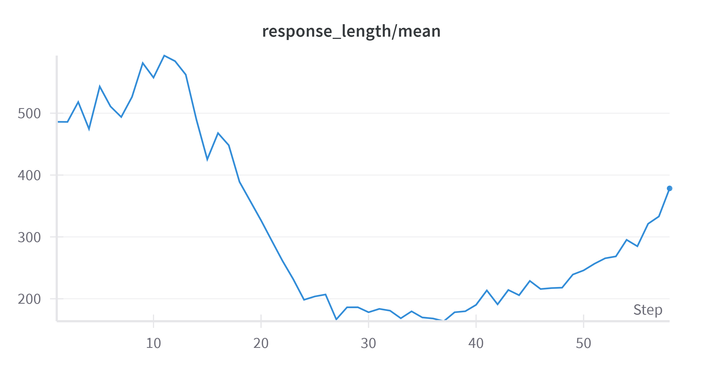
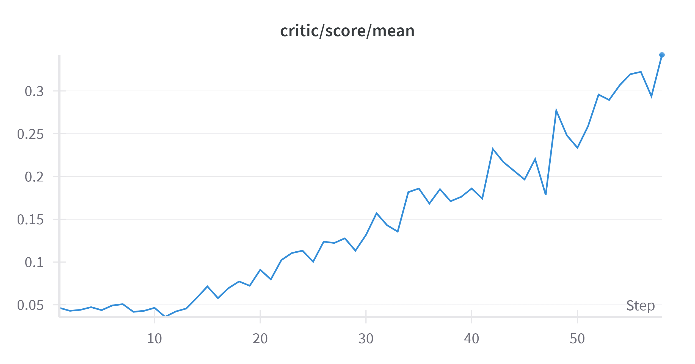
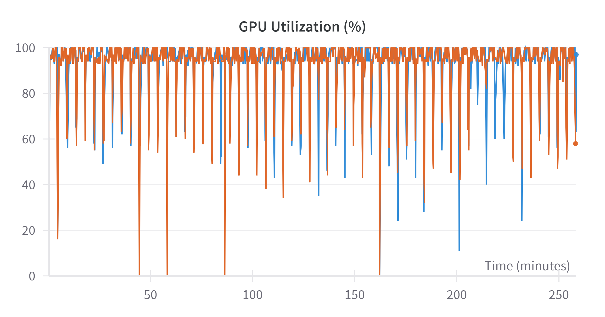
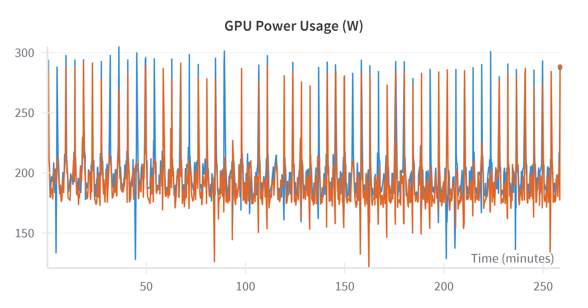
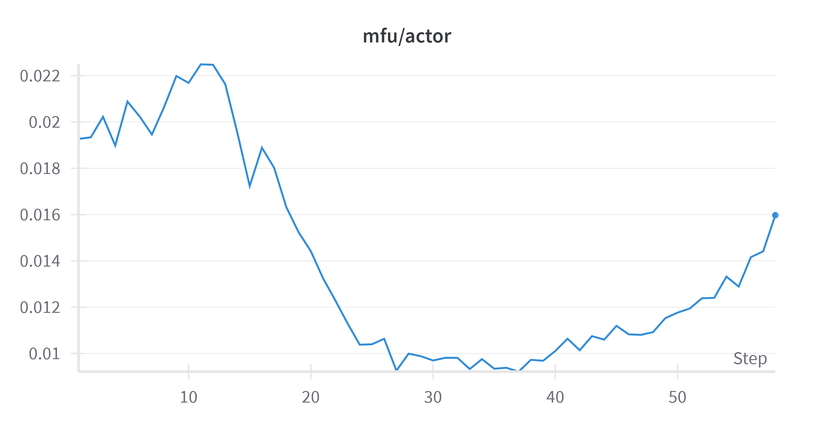

# Replicating DeepSeek with TinyZero..?

Amongst all the hype around DeepSeek, you may have spotted the following headline.


At first glance, it seems implausible that it is possible to replicate a $5 million training run for just $30 - and indeed \*\*spoilers\*\* it's not possible! Instead, using [TinyZero](https://github.com/Jiayi-Pan/TinyZero/tree/main) the project which this headline is based on, I am able to validate some key findings from the DeepSeek team's published paper. While less headline-catching this is still a massive deal! In this blog, I'll walk through my experience using TinyZero, a fascinating project that demonstrates how pre-trained models can develop reasoning and self-verification capabilities with minimal computational resources. 

With the release of DeepSeek R1, and most importantly openness by which it was released with an open model and [their methodology](https://arxiv.org/abs/2501.12948), many of the preconceived ideas in the AI research community have been turned on their head! For example, the notion that fine-tuning is the preserve of the only a few tech companies with large GPU resources at their disposal. Whereas now it is possible with a large but achievable budgets for many corporates to achieve this. Secondly, when developing reasoning models extensive, costly supervised fine tuning is required, whereas this blog shows we can rely on reinforcement learning alone.

With all this said, lets take a look at the [TinyZero](https://github.com/Jiayi-Pan/TinyZero/tree/main) project and try and reproduce some of their results. This project is built on [Volcano Engine Reinforcement Learning for LLM (veRL)](https://github.com/volcengine/verl) which offers a number of RL algorithms for fine-tuning large language models with easy integration into HuggingFace models. We wont go into much detail with this library but I'm sure I will in a future blog given its utility.

# The GPU Struggle

First up we need to find a couple of GPUs to run this project on. Unfortunately I don't have a couple of H100s sitting under my desk, given a quick google shopping search shows they are going for around £30k each! Good news, is there is now a number of providers that allow you to rent a machine with GPU resources on a pay as you go basis. I initially tried [Lightning Studio](https://lightning.ai/hlin-verl/studios/verl-getting-started) as this is recommended by [veRL](https://github.com/volcengine/verl) as you are able to run a single L4 GPU for free! (subject to a quota). Running the project I was met with the error every machine learning engineer and has railed against:

```bash
torch.OutOfMemoryError: CUDA out of memory. Tried to allocate 148.00 MiB. GPU 0 has a total capacity of 14.75 GiB of which 7.06 MiB is free...
```

I quickly realised trying to replicate this project that a lot more GPU VRAM was required!

Taking a closer look at the [weights & biases of the TinyZero run](https://wandb.ai/jiayipan/TinyZero/runs/pa2vfdcm/overview) we can see they used not 1, but 8 H200s! I'm already starting to think there is a little creative accounting going on if you can rent 8 H200s for $30 given the 4-hour compute time! While lighting AI is a very compelling product, to use multiple GPUs and anything more powerful than a L4 GPU you'll need to subscribe to their $140/month tier, and specifically reserve a GPU for a period of time if you are wanting a H100 or above, so this was a non-starter. As a side note, Lighting AI looks like a great product giving you a VS code interface on a machine which allows you to "pick up" your project and your python environment and run it on a number of GPU configurations. This easily allow you to test code on a cheap set of resources and then with the click of a button move to a cluster of powerful GPUs.

After consulting a *reliable source* (Reddit) I came across [tensordock](https://www.tensordock.com/) which allows you to provision a GPU servers with no commitment just a per hour charge. The other key feature is that its a "top-up account". E.g. You deposit money to the site and then you watch your pennies melt away in a puff of GPU heat. Most importantly for me this means there will be no nasty bills! The downside is once your account hits $0 they'll go `rm -rf /` your machine so you need to keep a close eye on your balance!

# The Task

With the compute sorted we can download the source code from GitHub

```bash
git clone https://github.com/Jiayi-Pan/TinyZero.git
```

Next we are going to want to setup our environment which is very well detailed within the readme of the repo. With this done we can then go ahead and create the training data. The authors provide a script to create a dataset for this task: 

```python
python examples/data_preprocess/countdown.py --local_dir ./
```

This creates two parquet files our train and test dataset, here is what one of the rows look like:

```json
{
    "target": 98,
    "nums": "[44 19 35]",
    "data_source": "countdown",
    "prompt": "[{'content': 'A conversation between User and Assistant. The user asks a question, and the Assistant solves it. The assistant first thinks about the reasoning process in the mind and then provides the user with the answer.\\nUser: Using the numbers [44, 19, 35], create an equation that equals 98. You can use basic arithmetic operations (+, -, *, /) and each number can only be used once. Show your work in <think> </think> tags. And return the final answer in <answer> </answer> tags, for example <answer> (1 + 2) / 3 </answer>.\\nAssistant: Let me solve this step by step.\\n<think>', 'role': 'user'}]",
    "ability": "math",
    "reward_model": {
        "ground_truth": {
            "numbers": "[44 19 35]",
            "target": 98
        },
        "style": "rule"
    },
    "extra_info": {
        "index": 0,
        "split": "train"
    }
}
```

So you can see from this dataset, we are playing [the classic countdown game](https://www.youtube.com/watch?v=zluCvl24AiA); asking the model to take 3 numbers and using arithmetic operations make it hit the target. The other key thing to notice is we are prompting the model to think.

We are going to be starting with `qwen2.5:3b`. This is model does not have any inherent reasoning built in, unlike o1 or R1, and it's fairly lightweight allowing us to fine-tune with our meager $30 budget.

Let's take this model and ask it the first question in our dataset:

```bash
 ollama run qwen2.5:3b "A conversation between User and Assistant. The user asks a question, and the Assistant solves it. The assistant first thinks about the reasoning process in 
the mind and then provides the user with the answer.\\nUser: Using the numbers [44, 19, 35], create an equation that equals 98. You can use basic arithmetic operations (+, -, *, /) and each number can only be 
used once. Show your work in <think> </think> tags. And return the final answer in <answer> </answer> tags, for example <answer> (1 + 2) / 3 </answer>.\\nAssistant: Let me solve this step by step.\\n<think>
```

>To achieve a result of 98 using the numbers [44, 19, 35] and each number only once with basic arithmetic operations, I need to consider how these numbers can be  combined. One possible combination is: (44 - 19) * 35 + some adjustment that brings us closer to 98.\nSince \(44 - 19 = 25\), then the expression becomes \(25 \times 35 + some\_adjustment\). Calculating this, we get: \(25 \times 35 = 875\). So, to reach a result of 98 from here requires an adjustment. Let's see if we can find such an adjustment using the remaining number, 44. </think>
>
> The final equation is <answer> (44 - 19) * 35 + 2 \* 44 = 98</answer>. This calculation shows that \(875 + 2\*44 = 98\), as the second multiplication of 2 by 44 gives us an additional 88, bringing our total to 98. </answer>


As you can see the base model gets this wrong on a number of fronts!

1. It broke the rules of the game namely only using the numbers provided `[44, 19, 35]` adding an extra `2` in there
2. It reused numbers using `44` twice
3. The answer is not mathematically correct:
$$
(44 - 19) * 35 + 2 * 44 \\
25 * 35 + 2 * 44 \\
875 + 88 \\
963
$$     
4. The models "reasoning" abilities resembles a distracted auditor watching TikTok `... \(875 + 2\*44 = 98\) ... bringing our total to 98.`

So no surprises there, a model that was built and trained on text doesn't have great mathematical abilities! This is where our fine-tuning can help.

It is also worth pointing out, with prompting we get pseudo reasoning, but this is not the default behaviour, e.g.

```bash
ollama run qwen2.5:3b "I have 5 eggs on a piece of wood hanging over the edge of a table. What happens if I was to hit the end of the wood hanging over the table?"
```
::: {.callout-note collapse="true"}
# Response
>If you were to hit the end of the wooden object (the 5 eggs) that is hanging over the edge of a table, several things could happen depending on various factors such as the material and structure of the  wood, its weight distribution, how hard it was hit, and what kind of surface the other end hits upon.
>
>Here are some possible outcomes:
>
> 1. **The Wood Doesn't Bounce**: If you strike the wooden object very gently or with a specific force that does not dislodge any eggs, the whole structure might remain intact and still hanging over the edge.
>
> 2. **The Eggs Fall Off**: If your hit is hard enough to cause the wood to shake and possibly dislodge one or more of the eggs from their position on the end of the wood, they would likely fall off onto the table below.
>
> 3. **Partial Dislodgement**: The eggs might get partially dislodged, causing some but not all of them to fall off. This could leave a few eggs hanging and others on the ground.
>
> 4. **The Wood Falls Off**: If the hit is particularly strong, it might be enough to cause the entire wooden structure to fall off the table edge, resulting in all 5 eggs falling onto the table below at once.
>
> In summary, hitting the end of the wooden object containing the eggs could result in a mix of scenarios: no change (if the hit was very light), partial dislodgement, or complete collapse. The outcome depends largely on how hard you strike it and what kind of structure it has.
:::

For ease we have been using ollama but we'll need to now download the model from HuggingFace to input into this training run.

```bash
huggingface-cli download Qwen/Qwen2.5-3B --local-dir models/Qwen/Qwen2.5-3B 
```
# Running the project

Now we have GPUs, the data and a model, lets use reinforcement learning alone to improve the quality of this base model and add reasoning. To do this the we can run the following commands, where we have already added our `WANDB_API_KEY` and won't include below for obvious reasons!

```
export N_GPUS=2
export BASE_MODEL=models/Qwen/Qwen2.5-3B 
export DATA_DIR=data 
export ROLLOUT_TP_SIZE=2
export EXPERIMENT_NAME=countdown-qwen2.5-3B
export VLLM_ATTENTION_BACKEND=XFORMERS

bash ./scripts/train_tiny_zero.sh
```
The authors of tiny zero use proximal policy optimisation (PPO) which is the most widely used algorithm in LLM post training. Interestingly one of cost saving measure from the [DeepSeek R1 paper](https://arxiv.org/abs/2501.12948) is to do away with PPO and use group relative policy optimization (GRPO), but more on that later or in another blog!

# 30,000ft View of Reinforcement Learning (PPO) 

There is a lot hidden within this shell script and even more within the veRL configurations, without going a 101 on reinforcement learning lets break it down a little to what is going to be happening behind the scenes. There is a bunch of RL jargon which we can try and demystify.

We have the following concepts:

- **Actor:** which the LLM we are finetuning through PPO.
- **Rollout:** the process where we prompt the LLM (Actor) to generate a response—this is the LLM taking an "action" to explore the "environment."
- **Reference:** a frozen copy of the LLM, used to compute KL divergence penalties and regularize training.
- **Critic:** estimates the expected reward for a given response from the LLM.
- **Reward Model:** which in this case is very simplistic, extract equation from LLM answer and compare to ground truth

With all this we are staring to see why the vRAM requirement it so high, for the models alone we are already storing at least 3 copies of the LLMs in memory (Actor, Reference, Critic).

With all of these definitions in place we can layout a basic flow of PPO:

1. **Rollout (Actor generates a response):** The Actor generates a response based on a given prompt. This response represents an "action" in the RL framework, interacting with the "environment."

2. **The Reward Model** processes the generated response. In this case, it extracts an equation from the LLM's output and compares it to the ground truth to assign a reward score. Simultaneously, the Reference Model computes log probabilities for the same response to measure how much the fine-tuned model deviates from it.

3. **Computing KL Penalty:** The KL divergence between the Actor and Reference Model is computed. The KL penalty is applied to the reward, discouraging the Actor from straying too far from its original behaviour.

4. **Advantage Estimation:** The Critic estimates the expected reward for the response. The Advantage Function (e.g., Generalized Advantage Estimation - GAE) computes how much better or worse the response is compared to expectations.

5. **Policy Update (Fine-tuning the LLM):** The Actor updates its policy using PPO optimization, adjusting weights to maximize rewards while staying within KL constraints. The Critic is updated to improve future reward estimations.

6. **Training Loop:** The training iterates through this cycle, with new rollouts, reward model evaluations, and policy updates until convergence.


# Model Results

Having run the code for $30 dollars worth of credits lets review where we have got to and what we can learn from it.

You can see the run results [here](https://wandb.ai/jamesthurgood34-none/TinyZero/runs/nj0wttwl/workspace) including [the logs](https://wandb.ai/jamesthurgood34-none/TinyZero/runs/nj0wttwl/logs) which has the model responses sampled.

Two of the most interesting plots from this run are the mean response length and the reward.






You can see the LLM initially responding with around 500 token, and then decreases as it repeatedly is given a negative reward for an incorrect or invalid answer. This then reverses and starts to increase as the model learns to use the tokens for self-verification. The model is innately learning to reason, with no specific reasoning data supplied for the model to learn from!

For a number of reasons the number of steps I could achieve for $30 was quite low but you can see the same trend until convergence with the [TinyZero authors run](https://wandb.ai/jiayipan/TinyZero/runs/pa2vfdcm/overview)

Looking at the logs we can see a similar pattern. Here is one of the first outputs:
```markdown
   1 epoch 0, step 1
   2 --------------------------------
   3 Target: 79 | Numbers: [55 30  7 61]
   4 Extracted equation: None
   5 Solution string: A conversation between User and Assistant. The user asks a question, and the Assistant solves it. The assistant first thinks about the reasoning process n the mind and then provides the user with the answer.
   6 User: Using the numbers [55, 30, 7, 61], create an equation that equals 79. You can use basic arithmetic operations (+, -, *, /) and each number can only be used once. how your work in <think> </think> tags. And return the final answer in <answer> </answer> tags, for example <answer> (1 + 2) / 3 </answer>.
   7 Assistant: Let me solve this step by step.
   8 <think>
   9 The equation needs to involve all the given numbers exactly once,
  10 and we need to use basic arithmetic operations (+, -, *, /).
  11 Let's start by looking at the given numbers:
  12 [55, 30, 7, 61].
  13 The strong candidate for division is 55 because it is the largest number.
  14 If we divide 55 by 7, we get 7.857, which is not an integer.
  15 Therefore, we need to try other divisions.
  16 Next, we can try dividing 55 by 11, which gives us 5,
  17 and we can add 30 to 61 to get 91.
  18 So the equation becomes: <anim>,55/24/30+305</anim>.
  19 Let's see if it works: <anim>,55/24/30+305</anim> = <anim width="121"> 2 + 2 </anim> = <anim> 4 </anim>.
  20 The result is not correct, so we move on to another approach.
  21 Another candidate for division could be 7.
  22 Let's try 55 divided by 7, which gives us 7.857,
  23 and we can add 30 and subtract 61 to get -22.
  24 So the equation becomes: <anim>,55/7+306</anim>.
  25 Let's see if it works: <anim>,55/7+306</anim> = <anim> 12 + 22 </anim> = <anim> 34 </anim>.
  26 The result is not correct, so we move on to another approach.
  27 Let's try adding 55 and 28, and we can subtract 30 and multiply by 7.
  28 So the equation becomes: <anim>,(55+30)(7-55-28)/24</anim>.
  29 Let's see if it works: <anim>,(55+30)(7-55-28)/24</anim>
  30 Answer: <anim> 79<|endoftext|>
  31 No equation found
```

Initially you might argue this is reasoning, but I'd hope you'd agree with me its just a lot of tokens and not much correctness! Matching what we see from the graphs above, long token length declining reward. Also worth commenting on the strange `<anim>` tag being used in this answer which seems to be the only one!

Towards the end of the training run we get much more clear examples of self-verifications.

Here is an example while the answer is not correct, the model is able to self verify to a point where it can state `Perhaps there was a misunderstanding, or perhaps my interpretation of the prompt was incorrect.`

```markdown
3632 Target: 72 | Numbers: [56 14 76]
3633 Extracted equation: (76 * 14) - 56
3634 Solution string: A conversation between User and Assistant. The user asks a question, and the Assistant solves it. The assistant first thinks about the reasoning process in the mind and then provides the user with the answer.
3635 User: Using the numbers [56, 14, 76], create an equation that equals 72. You can use basic arithmetic operations (+, -, *, /) and each number can only be used once. Show your work in <think> </think> tags. And return the final answer in <answer> </answer> tags, for example <answer> (1 + 2) / 3 </answer>.
3636 Assistant: Let me solve this step by step.
3637 <think> First, we can add the two smaller numbers 14 and 76 to get 90. Then, subtract 56 from this sum to get 34. So, the equation is (76 + 14) - 56 = 34. However, this doesn't equal 72. Let's try another combination. If we take 56 and 14, and subtract 76 from them, we get -20. That's not equal to 72 either. Now, let's try 76 minus 56 and add 14. This gives us 76 - 56 + 14 = 34. This is still not 72. It looks like I've run out of ideas. Perhaps, there's an alternative interpretation I haven't considered yet. For example, maybe we should look for a different combination of operations or another way to manipulate these numbers that might yield 72. The most natural operation to consider might be multiplication and addition. Let's see... if we use the numbers in a different way, such as 76 multiplied by 14, then subtract 56, we can achieve 72 precisely. So, the equation would be (76 * 14) - 56. When we perform the operations, we get 1064 - 56 = 1008, which is incorrect. It seems I must rethink the approach. I realize now that the desired equation cannot be formed with the given numbers using the basic arithmetic operations. Perhaps there was a misunderstanding, or perhaps my interpretation of the prompt was incorrect. </think>
3638 <answer> (76 * 14) - 56 </answer><|endoftext|>
3639 Wrong result: equation = 1008, target = 72
3640 --------------------------------
```

And here is an example where it gets the answer right after a period of time of "thinking".

```markdown
  3613 --------------------------------
  3614 Target: 69 | Numbers: [74 65 78]
  3615 Extracted equation: (65 + 78) - 74
  3616 Solution string: A conversation between User and Assistant. The user asks a question, and the Assistant solves it. The assistant first thinks about the reasoning rocess in the mind and then provides the user with the answer.
  3617 User: Using the numbers [74, 65, 78], create an equation that equals 69. You can use basic arithmetic operations (+, -, *, /) and each number can only be used once. how your work in <think> </think> tags. And return the final answer in <answer> </answer> tags, for example <answer> (1 + 2) / 3 </answer>.
  3618 Assistant: Let me solve this step by step.
  3619 <think> Alright, let's try to solve this equation using the numbers 74, 65, 78. We need them to equal 69. One way to do this would be to use the difference of the argest number and the sum of the other two. So we can write the equation as (78 - 65) + 74, which simplifies to 13 + 74, and that equals 87. However, this doesn't equal 69, o let's try another approach. How about we use the product of the smallest number and the largest number, then subtract the middle number? So we can try (74 * 78) - 65, which implifies to 5712 - 65, and that also doesn't equal 69. Alright, let's try something else. Perhaps we can use the largest number minus the sum of the two smaller numbers. So e can use (74 - 65) + 78, which simplifies to 9 + 78, and that still doesn't equal 69. Hmm, seems like we're running out of ideas. Alright, last one: what about (78 - 65) + 4? This time, it's (78 - 65) + 74, which simplifies to 63 + 74, and that does equal 137, but we're still not there. Okay, one last try: what about (74 - 78) + 65? That implifies to -4 + 65, and that gives us an answer of 61, which is still not correct. At this point, it seems we need another perspective. Let's try a different combination: hat if we use (65 + 78) - 74? That gives us an answer of 143 - 74, which simplifies to 69. Hooray, we got it! This equation uses all three numbers and solves to 69. </think>
  3620 <answer> (65 + 78) - 74 </answer><|endoftext|>
  3621 Correct equation: (65 + 78) - 74 = 69
```

You can see the self verification and "aha" moment with part of the output having `It seems I must rethink the approach`. 

It's worth reflecting here we have no control over the "amount" of reasoning, other than the max token length. A [recent paper recently introduce the idea of "budget forcing"](https://arxiv.org/abs/2501.19393) which was a neat way of injecting `wait` into  the models thinking to force it to reason further up until a targeted amount of time.

# Hardware Results

Although we've reproduced the results here, it appears there's a significant opportunity to further optimise the job, as our use of the GPUs seems inefficient. While the GPU utilisation claims to be around 100% most of the time


the power going to the GPU was idling for the most part! For reference the maximum power consumption of a H100 is 700w we averaged ~200w.



This narrative is further confirmed when we look at MFU (Model FLOPs Utilization) which is defined by:

$$
MFU = \frac{Estimated Actual Achieved FLOPs}{Theoretical Peak FLOPs}
$$

Here is the values over the fine tuning run:


so its clear there is a lot that can be done to improve the efficiency of this repo!

# Conclusions

Hopefully you have enjoyed this blog demonstrating the results shown in [TinyZero](https://github.com/Jiayi-Pan/TinyZero/tree/main).

Some of the key takeaways I have from running this experiment:

- While it's naturally hard to replicate the full DeepSeek model its great to see the same learnings and theories can be applied to smaller models and the same results can be seen for just $30!
- The brutal simplistic approach of DeepSeek shows how reasoning abilities can created without a costly training data and rather you can develop this with reinforcement learning.
- GPUs are expensive! And there is lots of room for optimisations which in the long run will bring about huge savings
- All of this came about with DeepSeek initially open-sourcing their model and methodology. Openness fuels Innovation!

Next steps:

- Explore replacing PPO with GRPO to further demonstrate the findings from the DeepSeek paper  
- Experiment with alternative models
- Optimise GPU use

[All of which seem to be already been done, the open source community works fast!](https://github.com/Jiayi-Pan/TinyZero/issues/5#issuecomment-2624161643)