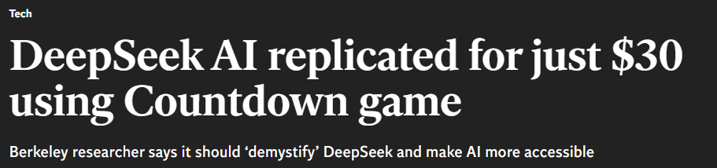

Amongst all the hype around DeepSeek you may have spotted the following headline.



At first glance, it seems implausible that it is possible to replicate a $5 million training run for just $30 - and indeed \*\*spoilers\*\* it's not possible! Instead, using [TinyZero](https://github.com/Jiayi-Pan/TinyZero/tree/main) the project which this headline is bases on, I am able to validate some key findings from the DeepSeek team's published paper. In this blog, I'll walk through my experience using TinyZero, a fascinating project that demonstrates how pre-trained models can develop self-verification and search capabilities with minimal computational resources. 

With the release of the DeepSeek R1 model and more importantly the fact that is was open sourced and the methodologies behind it shared in [the paper](https://arxiv.org/abs/2501.12948) it turned many of the pre-convcied ideas in AI research communities can be turned on their head! For example, the notion that fine-tuning is the preserve of the only the tech companies with large GPU resources at their disposal, whereas now it is possible with a large but achievable budgets for many corporates to achieve this. Secondly, when aligning models extensive, costly supervised fine tuning is required, whereas we can rely on reinforcement learning instead.

So lets take a look at the [TinyZero](https://github.com/Jiayi-Pan/TinyZero/tree/main) project and try and reproduce some of their results. This project is built on [Volcano Engine Reinforcement Learning for LLM (veRL)](https://github.com/volcengine/verl) which offers a number of RL algorithms for fine-tuning large language models with easy integration into HuggingFace models.

# Hosting

First up we need to find a couple of GPUs to run this project on. Unfortunately I don't have a couple of H100s sitting under my desk, given a quick google shopping search shows they are going for around £30k each! Good news is there is now a number of providers that allow you to rent a machine with GPU resources on a pay as you go basis. I initially tried [Lighting Studio](https://lightning.ai/hlin-verl/studios/verl-getting-started) as this is recommended by [veRL](https://github.com/volcengine/verl) as you are able to run a single 24GB L4 GPU for free! (subject to a quota). Running the project I was met with the error every machine learning engineer and has railed against:
```bash
torch.OutOfMemoryError: CUDA out of memory. Tried to allocate 148.00 MiB. GPU 0 has a total capacity of 14.75 GiB of which 7.06 MiB is free. Process 33992 has 14.74 GiB memory in use. Of the allocated memory 14.25 GiB is allocated by PyTorch, and 77.05 MiB is reserved by PyTorch but unallocated. If reserved but unallocated memory is large try setting PYTORCH_CUDA_ALLOC_CONF=expandable_segments:True to avoid fragmentation.  See documentation for Memory Management  (https://pytorch.org/docs/stable/notes/cuda.html#environment-variables)
```

I quickly realised trying to replicate this project that a lot more GPU RAM was required!

Taking a closer look at the [weights & biases of the TinyZero run](https://wandb.ai/jiayipan/TinyZero) we can see they used not 1, but 8 H100s! I'm already starting to think there is a little creative accounting going on if you can rent 8 H100s for $30 given the 2 day compute time! While lighting AI is a very compelling product, giving you a VS code interface on a machine which allows you to "pick up" your project and your python environment and run it on a number of GPU configurations, to start using multiple GPU and anything with more RAM than 24GB you'll need to subscribe to their $140/month tier, and specifically reserve a GPU for a period of time if you are wanting a H100 or above, so this was a non-starter.

After consulting a *reliable source* (Reddit) I came across [tensordock](https://www.tensordock.com/) which allows you to provision a GPU servers with no commitment just a per hour charge. The other key feature is that its a "top-up account". E.g. You deposit money to the site and then you watch you pennies melt away in a puff of GPU heat. This means there will be no nasty bills! The downside is once your account hits $0 they'll go `rm -rf /` you machine so you need to keep a close eye on your balance!

# Getting Started

The the compute sorted we can download the source code from GitHub

```bash
git clone https://github.com/Jiayi-Pan/TinyZero.git
```

Next we are going to want to setup our environment which is very well detailed within the readme of the repo.

With this done we can then go ahead and create the training data. To begin with we'll look at the countdown task.

The authors provide a script to create a dataset for this task: 

```python
python examples/data_preprocess/countdown.py --local_dir ./
```

With this we have created a train and test dataset, here is what one of the rows look like:

```json
{
    "target": 98,
    "nums": "[44 19 35]",
    "data_source": "countdown",
    "prompt": "[{'content': 'A conversation between User and Assistant. The user asks a question, and the Assistant solves it. The assistant first thinks about the reasoning process in the mind and then provides the user with the answer.\\nUser: Using the numbers [44, 19, 35], create an equation that equals 98. You can use basic arithmetic operations (+, -, *, /) and each number can only be used once. Show your work in <think> </think> tags. And return the final answer in <answer> </answer> tags, for example <answer> (1 + 2) / 3 </answer>.\\nAssistant: Let me solve this step by step.\\n<think>', 'role': 'user'}]",
    "ability": "math",
    "reward_model": {
        "ground_truth": {
            "numbers": "[44 19 35]",
            "target": 98
        },
        "style": "rule"
    },
    "extra_info": {
        "index": 0,
        "split": "train"
    }
}
```

So you can see from this dataset, we are asking the model to take 3 numbers and using arithmetic operations make it hit the target. The other key thing to notice is we are prompting the model to think.

We are going to be starting with `qwen2.5:3b`. This is model does not have any inherent reasoning built in, unlike o1 or R1, and is fairly lightweight allowing us to fine-tune with our meager $30 budget.

Let's take this model and ask it the first question in our dataset:

```{bash}
 ollama run qwen2.5:3b "A conversation between User and Assistant. The user asks a question, and the Assistant solves it. The assistant first thinks about the reasoning process in 
the mind and then provides the user with the answer.\\nUser: Using the numbers [44, 19, 35], create an equation that equals 98. You can use basic arithmetic operations (+, -, *, /) and each number can only be 
used once. Show your work in <think> </think> tags. And return the final answer in <answer> </answer> tags, for example <answer> (1 + 2) / 3 </answer>.\\nAssistant: Let me solve this step by step.\\n<think>
```

>To achieve a result of 98 using the numbers [44, 19, 35] and each number only once with basic arithmetic operations, I need to consider how these numbers can be  combined. One possible combination is: (44 - 19) * 35 + some adjustment that brings us closer to 98.\nSince \(44 - 19 = 25\), then the expression becomes \(25 \times 35 + some\_adjustment\). Calculating this, ?> we get: \(25 \times 35 = 875\). So, to reach a result of 98 from here requires an adjustment. Let's see if we can find such an adjustment using the remaining number, 44. </think>
>
> The final equation is <answer> (44 - 19) * 35 + 2 \* 44 = 98</answer>. This calculation shows that \(875 + 2\*44 = 98\), as the second multiplication of 2 by 44 gives > us an additional 88, bringing our total to 98. </answer>
```

As you can see the base model gets this wrong on a number of fronts!

    1. It broke the rules of the game namely only using the numbers provided `[44, 19, 35]`, although you've got to applaud the pluckiness of the LLM throwing an extra number in there in a hope we wouldn't notice.
    2. The answer is not mathematically correct:
        $$
        \begin{aligned}
        (44 - 19) * 35 + 2 * 44
        25 * 35 + 2 * 44
        875 + 88
        963
        $$
    3. The cherry on the cake is the proof at the end, getting both multiplications correct ($875$ and $44$) and then confidently claiming "bringing our total to 98"

So no surprises there, a model that was build and trained on text doesn't have great mathematical abilities! This is where our fine-tuning can help.

It is also worth pointing out, with prompting we get pseudo reasoning, but this is not the default behaviour, e.g.

```bash
ollama run qwen2.5:3b "I have 5 eggs on a piece of wood hanging over the edge of a table. What happens if I was to hit the end of the wood hanging over the table?"
```
>If you were to hit the end of the wooden object (the 5 eggs) that is hanging over the edge of a table, several things could happen depending on various factors such as the material and structure of the  wood, its weight distribution, how hard it was hit, and what kind of surface the other end hits upon.
>
>Here are some possible outcomes:
>
> 1. **The Wood Doesn't Bounce**: If you strike the wooden object very gently or with a specific force that does not dislodge any eggs, the whole structure might remain intact and still hanging over the edge.
>
> 2. **The Eggs Fall Off**: If your hit is hard enough to cause the wood to shake and possibly dislodge one or more of the eggs from their position on the end of the wood, they would likely fall off onto the table below.
>
> 3. **Partial Dislodgement**: The eggs might get partially dislodged, causing some but not all of them to fall off. This could leave a few eggs hanging and others on the ground.
>
> 4. **The Wood Falls Off**: If the hit is particularly strong, it might be enough to cause the entire wooden structure to fall off the table edge, resulting in all 5 eggs falling onto the table below at once.
>
> In summary, hitting the end of the wooden object containing the eggs could result in a mix of scenarios: no change (if the hit was very light), partial dislodgement, or complete collapse. The outcome depends largely on how hard you strike it and what kind of structure it has.


Now lets use reinforcement learning alone to improve the quality of this base model and add reasoning. To do this the 


```bash
git clone https://github.com/Jiayi-Pan/TinyZero.git
cd TinyZero

sudo apt install nvidia-cuda-toolkit

pip install torch==2.4.0 --index-url https://download.pytorch.org/whl/cu121
pip install vllm==0.6.3
pip install ray
pip install -e .
pip install flash-attn --no-build-isolation
pip install wandb IPython matplotlib


mkdir models
mkdir models/Qwen
mkdir models/Qwen/Qwen2.5-3B
huggingface-cli download Qwen/Qwen2.5-3B --local-dir models/Qwen/Qwen2.5-3B


mkdir data
python ./examples/data_preprocess/countdown.py --local_dir ./data


export N_GPUS=2
export BASE_MODEL=models/Qwen/Qwen2.5-3B 
export DATA_DIR=data 
export ROLLOUT_TP_SIZE=2
export EXPERIMENT_NAME=countdown-qwen2.5-3B
export VLLM_ATTENTION_BACKEND=XFORMERS
export WANDB_API_KEY=d8deb86c42ed1909b68d4dcc6473270073f0d2a2

bash ./scripts/train_tiny_zero.sh
```


## Stating to think!

3632 Target: 72 | Numbers: [56 14 76]
3633 Extracted equation: (76 * 14) - 56
3634 Solution string: A conversation between User and Assistant. The user asks a question, and the Assistant solves it. The assistant first thinks about the reasoning process in the mind and then provides the user with the answer.
3635 User: Using the numbers [56, 14, 76], create an equation that equals 72. You can use basic arithmetic operations (+, -, *, /) and each number can only be used once. Show your work in <think> </think> tags. And return the final answer in <answer> </answer> tags, for example <answer> (1 + 2) / 3 </answer>.
3636 Assistant: Let me solve this step by step.
3637 <think> First, we can add the two smaller numbers 14 and 76 to get 90. Then, subtract 56 from this sum to get 34. So, the equation is (76 + 14) - 56 = 34. However, this doesn't equal 72. Let's try another combination. If we take 56 and 14, and subtract 76 from them, we get -20. That's not equal to 72 either. Now, let's try 76 minus 56 and add 14. This gives us 76 - 56 + 14 = 34. This is still not 72. It looks like I've run out of ideas. Perhaps, there's an alternative interpretation I haven't considered yet. For example, maybe we should look for a different combination of operations or another way to manipulate these numbers that might yield 72. The most natural operation to consider might be multiplication and addition. Let's see... if we use the numbers in a different way, such as 76 multiplied by 14, then subtract 56, we can achieve 72 precisely. So, the equation would be (76 * 14) - 56. When we perform the operations, we get 1064 - 56 = 1008, which is incorrect. It seems I must rethink the approach. I realize now that the desired equation cannot be formed with the given numbers using the basic arithmetic operations. Perhaps there was a misunderstanding, or perhaps my interpretation of the prompt was incorrect. </think>
3638 <answer> (76 * 14) - 56 </answer><|endoftext|>
3639 Wrong result: equation = 1008, target = 72
3640 --------------------------------

# Final Sign off

If you've got this far well done (easter egg!)

# Resources


https://wandb.ai/jamesthurgood34-none/TinyZero?nw=nwuserjamesthurgood34


https://yugeten.github.io/posts/2025/01/ppogrpo/


